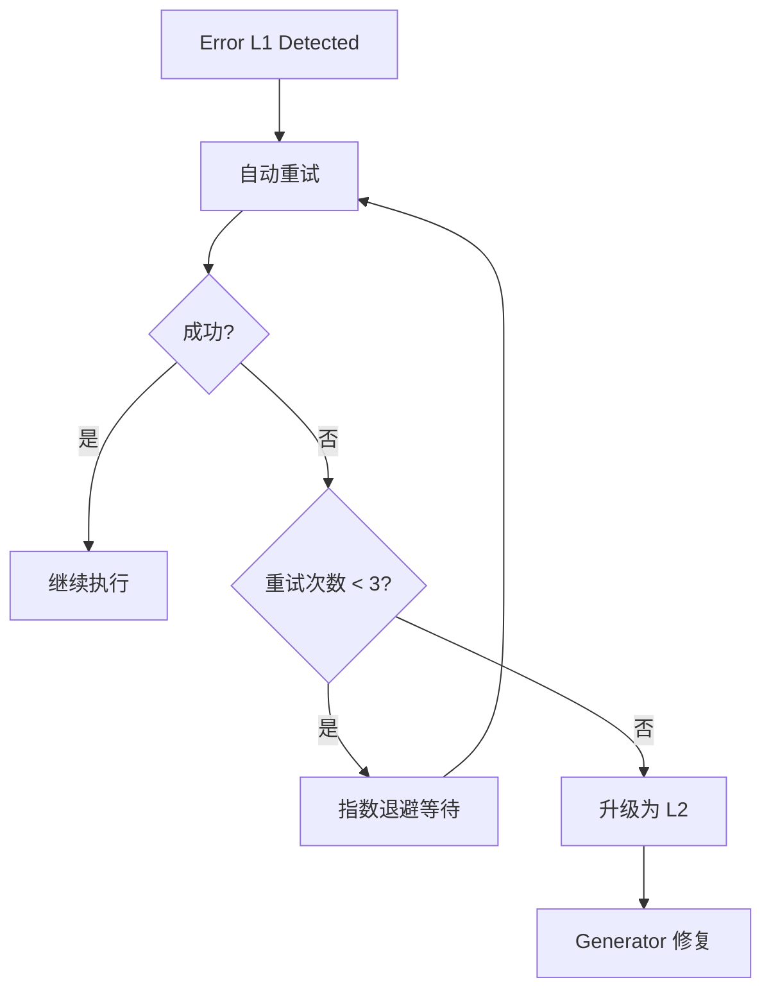
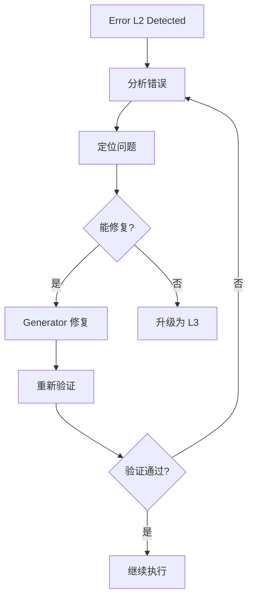
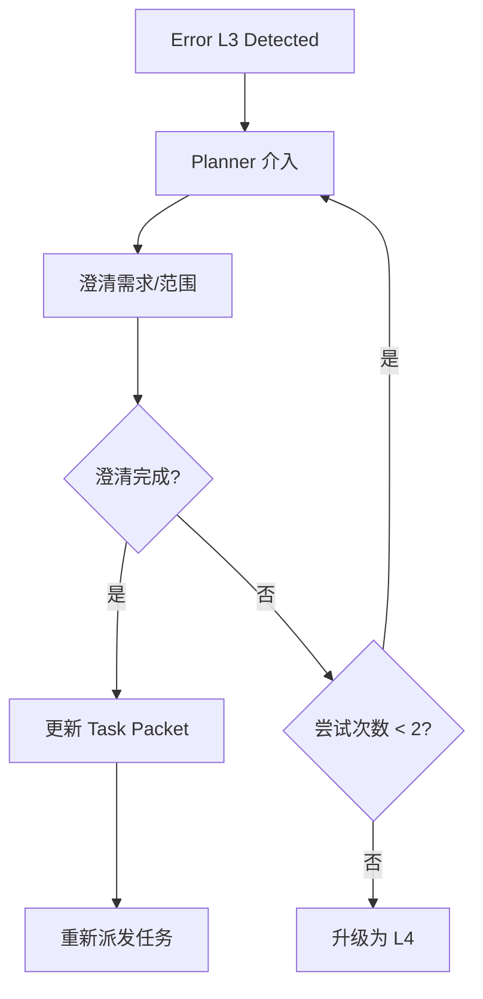
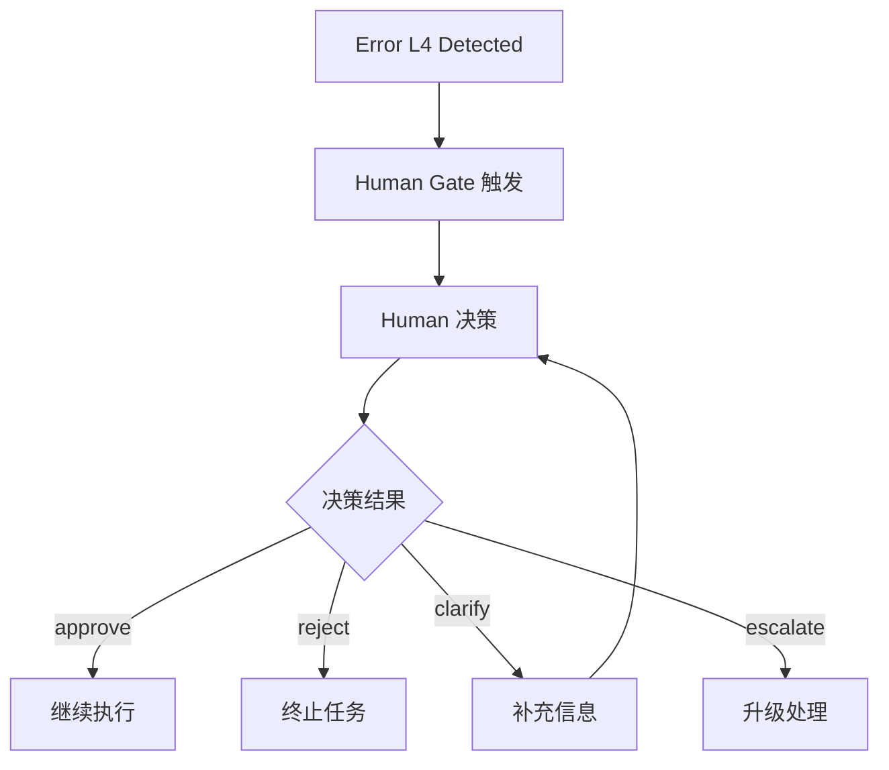

# 错误恢复策略

English version: [ERROR_RECOVERY_STRATEGY.en.md](./ERROR_RECOVERY_STRATEGY.en.md)

类型：Policy
归属层：method
状态：Active
版本：v1.0 (2026-06-26)

本文定义 harness 中的错误分类和恢复策略。

## 0. 版本历史

| 版本 | 日期 | 变更 |
|---|---|---|
| v1.0 | 2026-06-26 | 初始版本：L1-L4 错误分类、恢复流程、回滚机制 |

## 1. 概述

错误恢复策略确保 agent 在遇到错误时能够系统性地处理，而不是随机重试或直接放弃。本策略定义了：

- 错误的分类标准
- 每类错误的恢复流程
- 回滚机制
- 升级路径

## 2. 错误分类

### 2.1 分类级别

| 级别 | 类型 | 示例 | 自动恢复 |
|---|---|---|---|
| L1 | 可重试 | 网络超时、依赖拉取失败、临时的服务不可用 | 是 |
| L2 | 可修复 | Lint 错误、测试失败、类型检查失败 | 否 |
| L3 | 需澄清 | 需求歧义、scope 漂移、依赖冲突 | 否 |
| L4 | 需升级 | 架构冲突、安全问题、破坏性风险、Human Gate | 否 |

### 2.2 分类规则

```text
错误发生
  │
  ├─ 是否是暂时性问题（网络、超时、依赖）？
  │   └─ 是 → L1（可重试）
  │
  ├─ 是否是可修复的验证失败（lint、test、type）？
  │   └─ 是 → L2（可修复）
  │
  ├─ 是否是需求或范围问题（歧义、漂移）？
  │   └─ 是 → L3（需澄清）
  │
  └─ 是否是高风险或需要 Human 决策？
      └─ 是 → L4（需升级）
```

### 2.3 详细分类说明

#### L1: 可重试

**特征**:
- 临时性失败
- 重试后可能成功
- 不涉及代码逻辑问题

**示例**:
- 网络请求超时
- npm/pip/go mod 下载依赖失败
- CI 服务暂时不可用
- 外部 API 限流

**处理**: 自动重试，指数退避

#### L2: 可修复

**特征**:
- 代码或配置问题导致
- 需要代码修改才能解决
- 不涉及需求澄清

**示例**:
- Lint 错误
- 单元测试失败
- TypeScript 类型错误
- 构建失败

**处理**: Generator 修复后重新验证

#### L3: 需澄清

**特征**:
- 需求或范围不明确
- 需要 Human 或 Planner 提供更多信息
- 不是代码问题

**示例**:
- 需求歧义
- Scope 漂移
- 依赖项冲突
- 决策缺失

**处理**: Planner 介入澄清

#### L4: 需升级

**特征**:
- 高风险或破坏性
- 需要 Human 决策
- 超出 agent 权限范围

**示例**:
- 架构冲突
- 安全漏洞
- 数据库 schema 变更
- 删除大量文件
- Human Gate 触发项

**处理**: Human Gate

## 3. 恢复流程

### 3.1 L1 恢复流程



**配置**:
- 最大重试次数: 3
- 退避策略: 指数退避 (1s, 2s, 4s)
- 总超时: 10s

### 3.2 L2 恢复流程



**规则**:
- 修复尝试次数上限: 3
- 超过上限升级为 L3
- 每次修复必须验证

### 3.3 L3 恢复流程



**规则**:
- Planner 必须明确记录澄清内容
- Task Packet 更新后重新派发
- 多次无法澄清升级为 L4

### 3.4 L4 恢复流程



**规则**:
- 必须等待 Human 决策
- 决策必须记录到状态文件
- 不可绕过 Human 继续

## 4. 回滚机制

### 4.1 回滚触发条件

对于破坏性变更，以下情况应触发回滚：

- 部署后系统不可用
- 数据丢失或损坏
- 安全漏洞被引入
- 核心功能完全失效

### 4.2 回滚步骤

```markdown
## Rollback Execution

### 触发条件
<描述触发回滚的条件>

### 回滚步骤
1. `git revert <commit-hash>`
2. `restore <备份文件>`
3. `redeploy <如适用>`

### 回滚验证
- [ ] 功能正常
- [ ] 数据完整
- [ ] 无副作用
```

### 4.3 Task Packet 中的回滚计划

对于破坏性变更，Task Packet 必须包含回滚计划：

```markdown
## Rollback Plan

**Trigger Condition**: <什么情况下触发回滚>

**Rollback Steps**:
1. <具体步骤>
2. <具体步骤>

**Verification**:
- [ ] 功能验证命令
- [ ] 数据验证命令
```

## 5. 升级路径

### 5.1 升级规则

```text
L1 失败 3 次 -> L2
L2 失败 3 次 -> L3
L3 无法澄清 -> L4
L4 Human 拒绝 -> 任务终止
```

### 5.2 升级通知

每次升级必须通知相关方：

```markdown
## Error Escalation Notice

**Original Level**: L1
**New Level**: L2
**Reason**: <升级原因>
**Task ID**: <task-id>
**Timestamp**: <ISO8601>
**Next Owner**: <Planner/Human>
```

## 6. 错误记录

### 6.1 错误日志格式

```json
{
  "taskId": "task-id",
  "errorId": "error-uuid",
  "timestamp": "ISO8601",
  "level": "L1|L2|L3|L4",
  "type": "<error-type>",
  "message": "<error-message>",
  "context": {
    "file": "<file>",
    "line": "<line>",
    "command": "<command>"
  },
  "attemptCount": 1,
  "previousAttempts": [],
  "resolution": {
    "status": "pending|resolved|escalated",
    "resolvedBy": "<agent>",
    "resolution": "<resolution-description>",
    "resolvedAt": "ISO8601"
  }
}
```

### 6.2 错误聚合

同类错误频繁发生时，应触发 ratchet 升级：

- 同一类型错误出现 3 次 -> 考虑添加新的 guide 或 check
- 同一文件错误出现 3 次 -> 标记为技术债务
- 同一工具错误出现 3 次 -> 考虑更换工具或更新 adapter

## 7. 工具适配指南

工具 adapter 必须支持：

1. **错误分类**: 能够识别 L1-L4 错误
2. **自动重试**: L1 错误自动重试，指数退避
3. **升级路径**: 按规则升级到下一级别
4. **错误记录**: 记录所有错误到 `.harness/errors/`

工具 adapter 不应：

- 忽略 L1 错误而不重试
- 跳过 L2/L3 修复直接升级
- 绕过 Human Gate 继续执行 L4 任务
