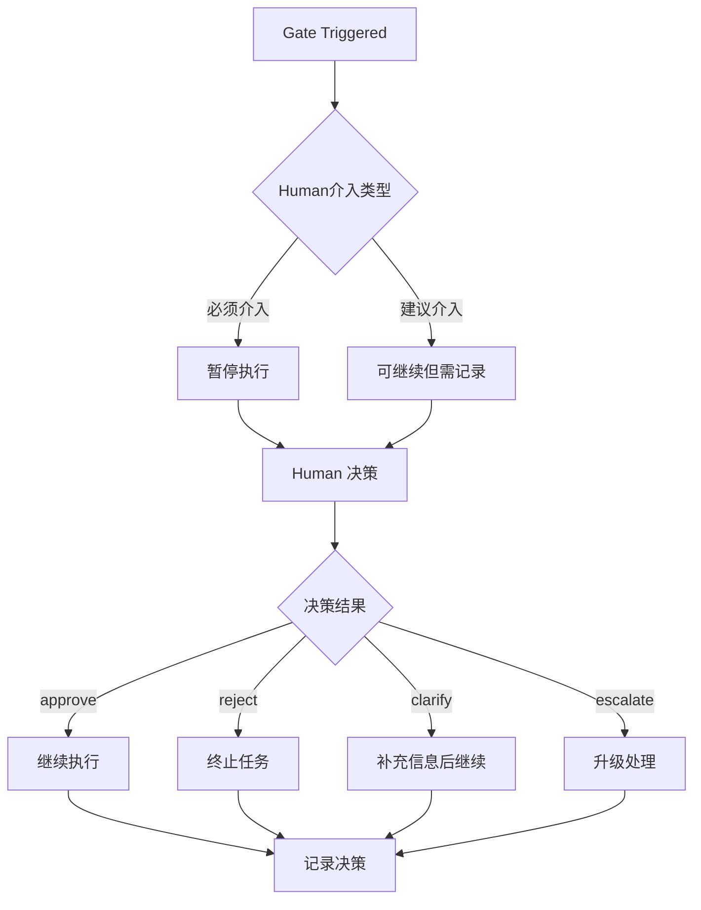

# Pantheon Harness 方法论

> 最后更新：2026-06-23
> 版本：[v1.0.0](../../VERSION)
> 变更历史：[CHANGELOG.md](../../CHANGELOG.md)
> 演化机制：[EVOLUTION.md](./EVOLUTION.md)
> 作者：人机协作（Human 定目标和验收，agent roles 规划、执行、验证、审查）

## 0. 核心原则

```
┌─────────────────────────────────────────────────────────┐
│                    角色分离模型                           │
│                                                         │
│   Human                 目标、边界、风险接受、结果验收       │
│   Planner/Dispatcher    规划、分派、上下文整理、停点控制     │
│   Generator             实现、修复、迁移、执行命令           │
│   Evaluator/Reviewer    验证、审查、证据质量判断             │
│                                                         │
│   铁律：工具只是 adapter，方法不绑定任何单一 agent runtime    │
│         Generator 不自行扩大架构、范围或风险接受边界          │
│         Human 不在中间环节反复搬运上下文                    │
└─────────────────────────────────────────────────────────┘
```

### 0.1 边界表

| 层级 | 谁决定 | 谁执行 | 谁验收 |
|---|---|---|---|
| 需求/范围/优先级 | **人** | — | **人** |
| 架构/方案/技术选型 | Planner/Architect 提案 | — | 人确认高影响 tradeoff |
| 代码实现 | — | Generator | Reviewer 审查 |
| 测试/构建/静态分析修复 | — | Generator | Evaluator/Reviewer 审查 |
| UI 视觉质量 | Designer/Reviewer 定标准 | Generator + UI quality gate | Reviewer + 人 |
| PR 合并 | — | — | Reviewer 审查 + 人确认 |
| 部署 | 人授权 | Operator/Generator | 人或运行态 gate 验证 |

### 0.2 角色能改什么、不能改什么

这些规则约束角色，不约束某个具体工具。一个工具可以扮演多个角色，但高风险任务应分离 Generator 和 Reviewer/Evaluator。

**Planner/Dispatcher 可以改或维护（治理层）：**
- `docs/` 下的所有文档
- `.codex/`、`.agents/` 或等价 adapter 配置
- `CLAUDE.md`、`AGENTS.md`、`DESIGN.md`、`GEMINI.md` 等治理入口
- 根配置：`sonar-project.properties`、`.gitignore`、`package.json`（scripts）
- CI/CD 工作流：`.github/workflows/`
- 项目记忆：`memory/`

**Planner/Dispatcher 默认不能直接改（代码层）：**
- `backend/` 下任何 `.go` 文件
- `frontend/src/` 下任何 `.ts`/`.tsx` 文件
- `database/` 下 SQL 文件
- `scripts/harness/` 下运行时脚本（测试除外）

**灰色地带处理：**
- 单字符 typo、注释修正、import 路径对齐 → Planner/Dispatcher 可改，改后记录
- 配置文件（`package.json`、`tsconfig.json`、`vite.config.ts`）→ Planner/Dispatcher 可改，但需要验证
- 测试文件 → 首选交给 Generator，仅在阻塞时 Planner/Dispatcher 可改并记录原因

---

## 1. 工作流全景

```
需求进来
  │
  ├─ 需求清晰吗？
  │   └─ 不清晰 → Planner 启动澄清路径
  │
  ├─ 方案确定吗？
  │   └─ 未确定 → Planner/Architect 出方案
  │
  ├─ 方案已批准
  │   │
  │   ├─ 是 UI 任务吗？
  │   │   └─ 是 → Generator + UI quality gate 执行
  │   │
  │   ├─ 需要并行执行吗？
  │   │   └─ 是 → Dispatcher 选择并行 adapter
  │   │
  │   ├─ 普通实现任务
  │   │   └─ Generator 执行
  │   │
  │   └─ 需要持久跟踪？
  │       └─ Dispatcher 选择 durable goal adapter
  │
  ├─ Generator 执行完毕
  │   └─ Reviewer 审查 diff 和 evidence
  │       │
  │       ├─ 通过 → 人验收
  │       └─ 不通过 → Reviewer 写修复指令 → Generator 再修
  │
  └─ 人验收
      ├─ 对照验收清单逐项检查
      ├─ UI 任务看截图证据
      └─ 通过 → 进入合并或发布 gate
```

---

## 2. 任务委派标准

每个任务交给任意 Generator adapter 前，Planner/Dispatcher 必须提供完整 Task Packet：

```text
目标仓库：    pantheon-base / pantheon-ops / pantheon-harness
任务层级：    platform / system/auth / system/iam / system/org / system/config / business/*
任务模式：    review / implement / ui / inheritance-sync / smoke / docs / sonar-fix
必读文档：    合同/设计/验收文档路径
实现范围：    具体改哪些文件/模块
禁止触碰：    明确不能改的区域
验证方式：    具体命令（go test / npm build / smoke suite / screenshot）
停止条件：    怎样算完成
```

---

## 3. 质量门禁矩阵（v1.1+ 增强）

### 3.1 按档位差异化配置

| 门禁 | L0 | L1 | L2 | 超时 | 失败处理 |
|---|---|---|---|---|---|
| Go 测试 | - | 修改的包 | 全部包 | 5min | 阻塞 PR |
| TypeScript 检查 | - | 涉及文件 | 全局 | 3min | 阻塞 PR |
| Lint | - | 涉及文件 | 全局 | 2min | 警告可过 |
| Frontend Build | - | 涉及模块 | 全栈 | 10min | 阻塞 PR |
| SonarQube | - | 新增问题 | 全部 | 15min | 按规则处理 |
| Smoke 测试 | - | 关键路径 | 完整套件 | 20min | 阻塞合并 |
| UI 检查 | - | - | 必须 | 10min/screen | 阻塞 |
| 安全审计 | - | - | 必须 | 30min | 阻塞 |

### 3.2 门禁执行规则

| 门禁 | 触发条件 | 执行者 | 通过标准 |
|---|---|---|---|
| Go 测试 | 任何 Go 改动 | Generator -> Reviewer 审查 | 全部通过 |
| TypeScript 类型检查 | 任何前端改动 | Generator | `tsc -b` 干净 |
| Lint | 任何前端改动 | Generator | 0 error |
| Frontend Build | 任何前端改动 | Generator | `vite build` 成功 |
| SonarQube | PR 级别 | CI 自动 | 0 新增问题 |
| Smoke 测试 | 系统模块改动 | CI / Generator | 通过率 >= 95% |
| UI 视觉 | 任何 UI 改动 | Generator + UI quality gate | 渲染证据通过 |
| 安全审计 | 认证/权限/中间件改动 | Security reviewer / security sensor | 无高危/严重 |
| 继承漂移 | 跨仓改动 | Reviewer / drift sensor | 漂移可解释 |

### 3.3 门禁通过标准详解

```text
通过 = 所有必需门禁已执行且结果满足标准
阻塞 = 任一必需门禁未通过或未执行
警告 = 非必需门禁未通过，记录但不阻塞
```

---

## 4. SonarQube 质量闭环

### 4.1 扫描时机

| 时机 | 触发 |
|---|---|
| PR 推送 | CI 自动（SonarCloud） |
| 本地预检 | Dispatcher 派 Generator 或 CI adapter 跑 `sonar-scanner` |

### 4.2 问题分类与处理

| 分类 | 判定标准 | 处理方式 |
|---|---|---|
| 假阳性 | 有防护代码（如 `filepath.IsLocal()`）、业务合理 | 记录原因 → 加排除规则 → 不再反复处理 |
| 低风险 | Code Smell 不影响功能 | 记录 → 低优先级队列 → 批量修复 |
| 必须修 | Bug/Vulnerability，有安全或功能影响 | Generator 立即修复 → Reviewer 审查 |

### 4.3 修复流程

```
CI SonarQube 扫描
  │
  ├─ 0 新增问题 → 通过 ✅
  │
  └─ 有新增问题
      │
      ├─ Reviewer 审查报告
      │   ├─ 假阳性 → Dispatcher/Reviewer 更新排除规则 → 记录原因
      │   ├─ 低风险 → Dispatcher 记录到低优先级队列
      │   └─ 必须修 → Reviewer 写修复指令 → Generator 执行 → Reviewer 审查 diff
      │
      └─ 修复后重新扫描 → 循环直到 0 新增
```

---

## 5. 文档体系

```
docs/
├── HARNESS_METHODOLOGY.zh.md     ← 本文件（方法总纲）
├── WORKFLOW_ROUTING.md           ← 工具路由决策树
├── WORKSPACE_INHERITANCE.md      ← 仓库角色与继承关系
├── ACCEPTANCE_CHECKLIST.zh.md    ← 非程序员验收清单
├── TASK_DELEGATION_TEMPLATE.md   ← Planner/Dispatcher→Generator 任务委派模板
├── codex-development-process-improvement.md  ← 流程增强背景
├── codex-workflow-quick-reference.md         ← 命令速查
├── SONARQUBE_RULES.md            ← SonarQube 规则与排除原因
└── MIGRATION_LOG.md              ← Superpowers→OMX 迁移记录
```

---

## 6. 人机协作章程

### 6.1 人的职责

- 说清楚"要做什么"和"为什么"
- 定义验收标准（对照验收清单）
- 最终确认 PR 合并
- 不介入中间实现细节

### 6.2 Planner/Dispatcher 的职责

- 理解需求，分解任务
- 选择满足同一 harness capability 的最小 adapter 和执行路径
- 按 Task Packet 模板委派给 Generator
- 组织 Reviewer/Evaluator 审查 Generator 产出的 diff 和 evidence
- 维护治理文档和方法论

### 6.3 Generator 的职责

- 按 Task Packet 执行实现
- 跑完指定的验证命令
- 不自行扩大范围
- 不自行决定架构变更
- 失败时报告具体错误、已尝试动作和下一步建议

### 6.4 协同交接规则

默认目标是“人做判断，agent 做上下文搬运和证据整理”。每次非 trivial 协作都应满足：

- 人只需要补充目标、优先级、风险接受、验收口径和 high-impact gate 决策。
- Planner/Dispatcher 负责把需求变成 Task Packet，并写清 scope、禁止触碰区域、验证命令、stop points 和 handoff artifact。
- Generator 负责执行、验证、保存 evidence，并把失败原因压缩成下一轮可执行输入。
- Review 必须回指同一份 Task Packet 和 evidence；如果结论冲突，先升级为 review gate，而不是让实现者自行扩大范围。
- 任何 human gate 决策都要写回可恢复 state：决定、证据、接受的风险和下一步 owner。
- 如果人连续两次解释同一类上下文，应把问题升级为 guide、template、adapter 或 sensor 缺口，而不是继续靠聊天记忆。

---

## 7. Human Gate 标准（v1.1+ 新增）

### 7.1 强制介入点（必须）

以下情况必须 Human 介入确认：

1. **架构决策点**: 涉及跨层依赖、接口变更、新增服务
2. **破坏性变更**: 数据库 schema 变更、权限模型变更、API breaking change
3. **高风险操作**: 删除文件、修改 secrets、变更 CI/CD
4. **首次某类任务**: 引入新技术栈、首次某类模块

### 7.2 可选介入点（建议）

以下情况建议 Human 介入：

1. **方案评审**: 涉及较大技术选型时
2. **PR 合并前**: 最终验收确认
3. **阻塞升级**: Agent 无法自行解决时

### 7.3 Human 反馈格式

```markdown
## Human Decision

**Task ID**: <task-id>
**Decision Type**: approve | reject | clarify | escalate
**Decision Content**: <具体决策描述>
**Risk Accepted**: yes | no | with-mitigation
**Mitigation Applied**: <如适用>
**Next Action**: <具体行动或 owner>
**Deadline**: <如适用>
**Timestamp**: <ISO8601>
```

### 7.4 Human Gate 触发流程



---

## 8. 版本演进

| 版本 | 日期 | 变更 |
|---|---|---|
| v1.0 | 2026-06-15 | 初始版本：角色分离模型、Task Packet 模板、SonarQube 闭环、验收清单 |
| v1.0.1 | 2026-06-23 | 将总纲从 Claude/Codex 固定分工改为工具无关角色分离模型 |
| v1.1 | 2026-06-26 | 增强质量门禁矩阵（按档位差异化）、新增 Human Gate 标准 |
